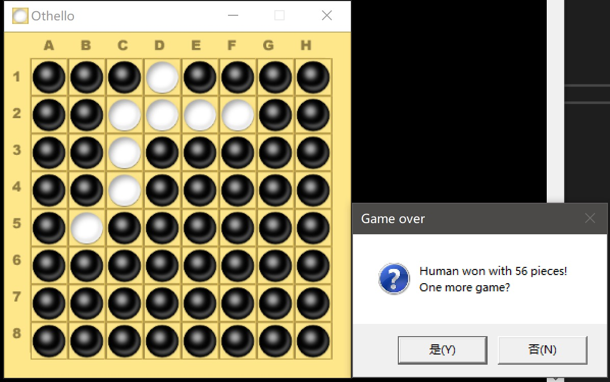
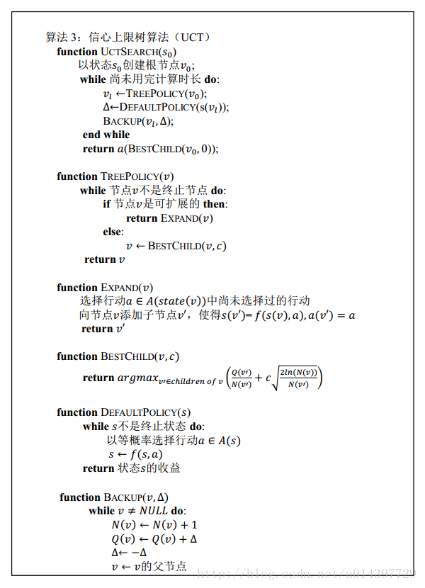

# **miniAlphaGo for Reversi**

* 图形界面基于EasyX 2018开发

* UCT算法是蒙特卡罗规划方法的改进，是将UCB1算法（信心上限算法）思想用于蒙特卡罗规划的特定算法，它比单纯的蒙特卡罗规划更容易获得最优解

* References
  * http://mcts.ai/code/java.html
  * https://blog.csdn.net/u014397729/article/details/27366363